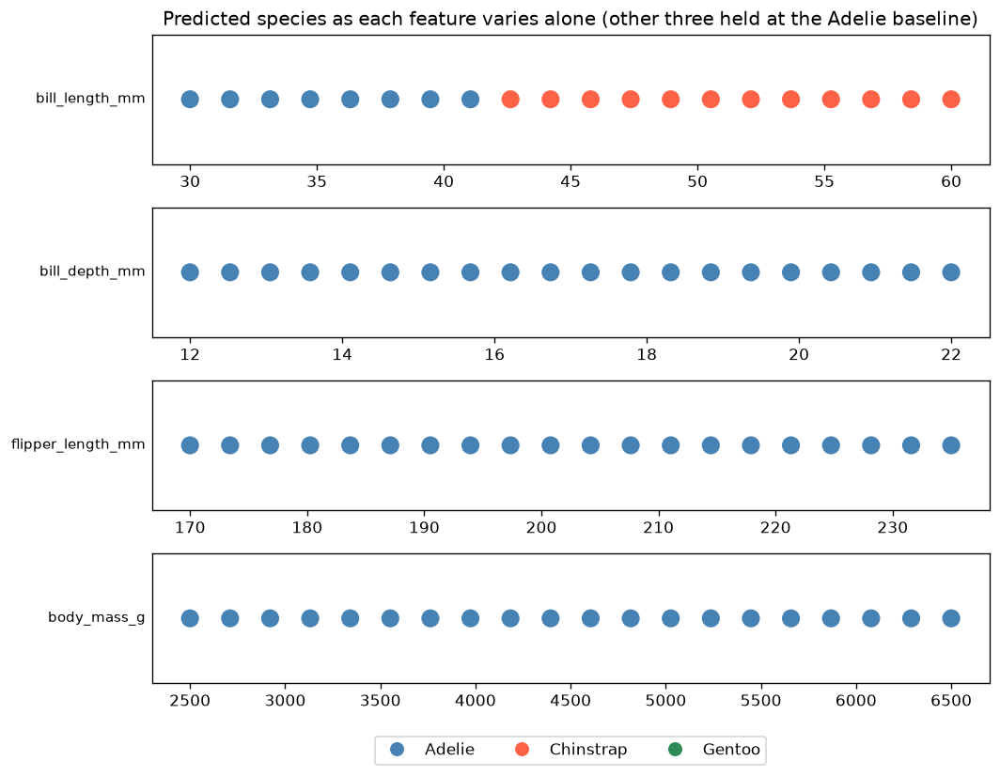
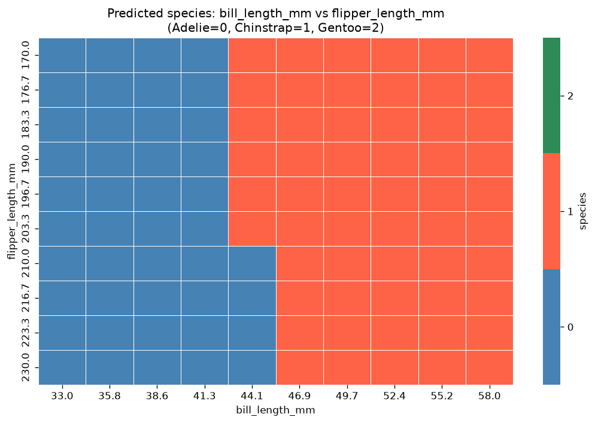
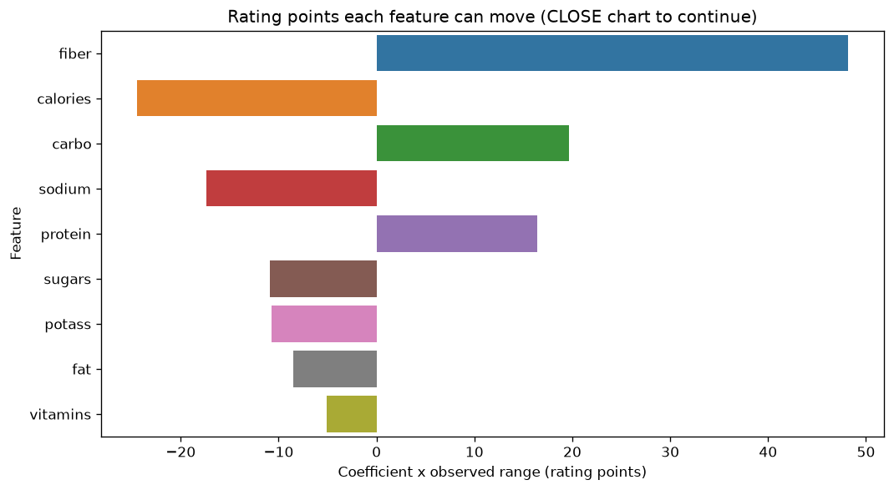

# Project Documentation

This site provides project documentation.
Use the documentation navigation to explore.

## How-To Guide

Many instructions are common to all our projects.

See
[⭐ **Workflow: Apply Example**](https://denisecase.github.io/pro-analytics-02/workflow-b-apply-example-project/)
to get the example projects running on your machine.

## Project Documentation Pages (docs/)

- **Home** - this documentation landing page
- [**Project Instructions**](./project-instructions.md)  - the standard project workflow
- [**Your Files**](./your-files.md) - how to copy the example and create your version
- [**Glossary**](./glossary.md) - project terms and concepts
- [**API**](./api.md) - autogenerated code documentation for the public project interface

## Phase 4. Technical Modification

I copied `notebooks/ml_07_case.ipynb` to `notebooks/ml_07_teja_p4.ipynb` and
left the original example untouched.

### What I changed

The example sweeps one feature, `bill_length_mm`, and then asks the reader
which feature produces the sharpest boundary - a question one sweep cannot
answer. I added **Section 3b**, which reuses the example's own
`sweep_feature()` function on all four features across their realistic ranges
(4 x 20 = 80 calls) and ranks them by two measurements:

- **changed %** - the share of swept values whose prediction differs from the
  baseline, i.e. how much influence the feature has.
- **crossings** - how many times the label flips. One crossing is a clean,
  sharp boundary; several suggest the feature interacts with the others.

### Why I chose that change

It answers the notebook's own open question, and it costs almost nothing: one
loop, one summary function, and one chart, all built on a function the example
already provides. Nothing about the API call itself changes.

### How I verified it worked

I ran the notebook end to end headlessly:

```shell
uv run python -m nbconvert --to notebook --execute --inplace notebooks/ml_07_teja_p4.ipynb
```

It completes with `Executed successfully!` and produces three charts instead
of two. The example notebook still runs unchanged alongside it.

### What result confirmed the change

| feature | changed % | crossings | species seen | boundary |
| --- | --- | --- | --- | --- |
| `bill_length_mm` | **60.0** | 1 | 2 | Adelie -> Chinstrap near **41.8 mm** |
| `bill_depth_mm` | 0.0 | 0 | 1 | none |
| `flipper_length_mm` | 0.0 | 0 | 1 | none |
| `body_mass_g` | 0.0 | 0 | 1 | none |



`bill_length_mm` is not merely the most influential feature - it is the only
one with a boundary at all. Sweeping bill depth, flipper length, and body mass
across their full realistic ranges never moved the prediction off Adelie, not
once in 60 calls.

### Three bugs the measurement caught

Measuring instead of eyeballing exposed three places where the example reports
something incorrectly. I fixed each one in my copy:

1. **A false `MISMATCH`.** The example's 30-second timeout is shorter than a
   cold start on this free-tier host (I measured about 50 seconds), so the
   first baseline call timed out and was scored as a wrong prediction. I
   raised the timeout and warm the server up before the baseline check.
2. **A fake decision boundary.** On my first full run, a single dropped
   connection mid-sweep left an error string where a species should have been,
   and my own boundary detector dutifully counted it as a boundary -
   `flipper_length_mm` appeared to have 2 crossings. Transient failures are now
   retried; an HTTP 4xx is the server's real answer and is never retried. On
   the clean re-run, `flipper_length_mm` correctly reports 0 crossings.
3. **A mislabeled heatmap.** Section 3b proved Gentoo is never predicted from
   this baseline, yet the example's grid rendered large regions in seagreen -
   the color its own title assigns to Gentoo. The cause is that the color list
   is stretched across only the values actually present, so with two species on
   the grid, Chinstrap (1) took the last color instead of the middle one.
   Pinning `vmin=-0.5` and `vmax=2.5` fixes it in two arguments.



### Clearing the editor's type errors

VS Code reports type errors on the example notebook that the project's
`pyright` command never sees, because `pyproject.toml` scopes type checking to
`src` and `tests` only - notebooks are outside it. I fixed both in my copy:

- **`sweep_feature(values: list[float])` rejects `np.linspace()` output.**
  `list` is invariant, so `list[np.float64]` is not a `list[float]` even though
  `np.float64` subclasses `float`. Widening the parameter to `Sequence[float]`,
  which is covariant, fixes every call site at once - and the call sites stay
  byte-identical to the example.
- **`Series.map()` given a dict.** Passing a dict is documented, supported
  pandas behavior that the example relies on and that works at runtime; the
  bundled stubs simply type the argument as callable-only. That is a stub
  limitation rather than a defect, so it gets an inline `# pyright: ignore`,
  the same idiom the example already uses for `plt.Line2D`.

Verified by exporting the notebook and type-checking it directly:

```shell
uv run python -m nbconvert --to script notebooks/ml_07_teja_p4.ipynb
uv run python -m pyright notebooks/ml_07_teja_p4.py
```

My notebook reports **0 errors, 0 warnings**. Neither fix changes behavior -
the sweep produces the same numbers either way.

### What is different, and why it matters

Compared with the example, every original section still runs the same way and
produces the same charts. The differences are the added Section 3b, the three
corrections above, and the boundary positions now logged per grid row rather
than left as a picture to squint at.

It matters because the example's conclusion - "vary a feature and see what
changes" - quietly depends on the API answering honestly every time. Two of my
three fixes are cases where a network problem was reported as if it were a
model answer, which is exactly the kind of error an investigation from the
outside cannot afford.

### Easy or challenging?

The sweep itself was easy: `sweep_feature()` already did the work, so Section
3b is a loop and a summary function. The interesting difficulty was
interpreting a *null* result. Three features reporting 0.0% looked at first
like a broken payload, and I only trusted it after the grid in Section 4
showed `flipper_length_mm` shifting the bill-length boundary from 44.1 mm to
46.9 mm for flippers of 210 mm and longer. So the feature is not ignored by the
model - it is inactive at this baseline, because bill length 39.1 mm sits far
inside Adelie territory and leaves the other features nothing to tip.

That distinction is the real lesson: a one-feature-at-a-time sweep measures
**local** sensitivity at one point in feature space, not global importance.

## Phase 5. Custom Project

**What makes a breakfast cereal highly rated?**

A cereal box tells you the nutrition facts. A rating tells you whether the
cereal is any good. I set out to recover the relationship between the two from
the outside, without being told the rule.

My files:

| File | Purpose |
| --- | --- |
| `notebooks/ml_07_teja_p5.ipynb` | the investigation and narrative |
| `src/mlstudio/app_cereal_teja.py` | the model, served behind an API-shaped contract |
| `tests/test_app_cereal_teja.py` | smoke test plus a refuses-incomplete-payload test |
| `data/raw/cereal.csv` | 77 cereals x 16 columns |

```shell
uv run python -m mlstudio.app_cereal_teja
```

### Basis and API

The example project probes a **deployed penguin classifier** at
`https://ml-penguin-predictor.onrender.com/predict`. It accepts a JSON payload
of four measurements (bill length, bill depth, flipper length, body mass) and
returns one of three species. The model is trained and served elsewhere, so the
only way to learn anything about it is to send inputs and read outputs.

I changed the endpoint, because there is no public cereal-rating API to call.
Instead I train a `LinearRegression` model on the cereals data and then **put it
behind the same contract**: `predict(model, payload)` takes a dict of the nine
nutrition features and returns a rating, and raises on an incomplete payload
the way the penguin API returns HTTP 400. After training, I stop looking at how
the model was built and probe it only through that one function.

Keeping the contract identical is what let every technique transfer over:

| Example (penguins) | This project (cereals) |
| --- | --- |
| `POST /predict` over HTTP | `predict(model, payload)` |
| classification, 3 species | regression, rating 0-100 |
| baseline: one penguin per species | baseline: the median cereal |
| sweep `bill_length_mm` | sweep each of 9 nutrition features |
| decision boundary | response curve and slope |
| grid: bill length x flipper length | grid: fiber x sugars |
| edge cases: 999mm bill, missing field | edge cases: 1000g fiber, missing field |

### Data

[80 Cereals](https://www.kaggle.com/datasets/crawford/80-cereals) (Kaggle,
originally Carnegie Mellon StatLib): 77 cereals, 16 columns. The nine nutrition
columns are the features and `rating` is the target. Identity columns (`name`,
`mfr`, `type`) and `shelf` are excluded on purpose - the question is whether
nutrition **alone** explains the rating. Four values across three cereals are
dropped for the reason given below, leaving 74 rows for modeling.

### Investigation Approach

0. **Check the data honestly** - count sentinel values, not just blank cells,
   and use the model itself to decide whether affected rows can be repaired.
1. **Baseline** - predict the rating of the median cereal, to have a known
   reference point every probe is measured against.
2. **One-feature sweeps** - vary each of the nine features across the range it
   actually spans in the data, holding the rest at the median.
3. **Influence ranking** - the Phase 4 method carried forward: rank features by
   coefficient x observed range, not by coefficient alone.
4. **Two-feature grid** - vary fiber and sugars together to map the trade-off.
5. **Edge cases** - send input that is not a cereal and see whether the model
   refuses or answers.

### Findings: The Data Looks Clean and Is Not

`cereal.csv` has no blank cells, so `isna()` reports zero missing values and the
data passes a standard quality check. It should not. Four values across three
cereals are recorded as the sentinel `-1`, meaning "not measured":

| cereal | column(s) with -1 |
| --- | --- |
| Almond Delight | potass |
| Cream of Wheat (Quick) | potass |
| Quaker Oatmeal | carbo, sugars |

Dropping those rows is the safe move, but the model let me do better than
assume. It was trained only on cereals with no sentinel, so those three rows are
genuinely unseen data. Feeding each one in with `-1` taken **literally**:

| cereal | published | predicted using -1 | predicted using 0 |
| --- | --- | --- | --- |
| Almond Delight | 34.3848 | **34.3848** | 34.3508 |
| Cream of Wheat (Quick) | 64.5338 | **64.5338** | 64.4998 |
| Quaker Oatmeal | 50.8284 | **50.8284** | 51.1959 |

`-1` reproduces all three published ratings exactly; a sensible `0` misses all
three. So the rating column was computed without cleaning the sentinel first -
the formula ran straight over the stored values, and these cereals carry ratings
derived from a negative gram count. Quaker Oatmeal's is off by about 0.37
points.

That settles the modeling question. These rows are not merely missing a feature;
their **target** is unreliable too, so imputing the feature would not rescue
them - it would teach the model to reproduce a data-entry artifact. All three are
dropped, and the decision is backed by evidence rather than convention.

It is also the module's own lesson turned back on the data: probing a model from
the outside revealed something about how the dataset itself was built.

### Findings: The Target Is a Formula

R-squared is **1.000000**. The largest residual on the held-out test cereals is
**5.2e-07** rating points, which is float rounding rather than error.

The model does not approximate the rating; it reproduces it exactly. A score
carrying human judgment could never fit that way, so the investigation answered
a question I had not thought to ask: `rating` in this dataset is **not an
opinion, it is a formula** - a fixed linear function of the nine nutrition
columns. Everything after this point is not "what did the model learn about
cereal" but "what is the formula, recovered from the outside".

Every response curve being a perfectly straight line is the visual confirmation.

### Findings: Feature Sensitivity



| feature | coefficient | observed range | real influence |
| --- | --- | --- | --- |
| `fiber` | **+3.44** | 14 | **+48.2** |
| `calories` | -0.22 | 110 | **-24.5** |
| `carbo` | +1.09 | 18 | +19.7 |
| `sodium` | -0.05 | 320 | -17.4 |
| `protein` | **+3.27** | 5 | +16.4 |
| `sugars` | -0.72 | 15 | -10.9 |
| `potass` | -0.03 | 315 | -10.7 |
| `fat` | -1.69 | 5 | -8.5 |
| `vitamins` | -0.05 | 100 | -5.1 |

- **Fiber is the strongest lever by a wide margin** - 48 rating points, more
  than the next two features combined. One gram of fiber cancels about 4.8
  grams of sugar.
- **Ranking by coefficient gives the wrong answer.** `protein` has nearly
  fiber's coefficient but cereals span only 1g to 6g of protein, so it can move
  a rating 16 points at most. `calories` has a coefficient 15x smaller than
  protein's and 1.5x the real influence, because it ranges over 110 units.
- **The surprise: sugar is not the villain.** I expected sugar to dominate a
  cereal healthiness score. It ranks sixth, behind sodium.

This is the Phase 4 lesson in a new setting: the ranking you get depends
entirely on whether you account for how far an input can realistically move.

### Findings: Edge Cases

| probe | predicted rating | verdict |
| --- | --- | --- |
| negative sugars (-5g) | 49.1 | answered without complaint |
| impossible fiber (1000g) | **3477.0** | far outside the 0-100 scale |
| candy bar calories (5000) | **-1048.7** | far outside the 0-100 scale |
| a box of literally nothing | **54.9** | beats 62 of 74 real cereals |
| missing a required field | refused | correct |

**The formula has no guardrails.** It is a straight line extended forever in
every direction, so it reports a rating of 3477 on a 0-100 scale without
hesitation. The example project finds exactly the same weakness in the penguin
API, which classifies a 999mm bill without complaint. A linear model cannot
know the edge of its own training range, so something outside the model has to
enforce it.

**An empty box scores 54.9 and beats 84% of real cereals.** That number is the
model's intercept, and it is a real property of the formula: the score starts
high and cereals lose points for what they contain. Only 12 of 74 cereals - the
bran and shredded wheat end of the aisle - do better than nothing at all.

The contract itself is the one thing done right: an incomplete payload raises
rather than being silently filled in, mirroring the API's HTTP 400.

### Summary

**What I learned about the model's behavior.** It is perfectly confident and
perfectly linear, because it is not really a model - it is a formula I
recovered by probing it. It is trustworthy inside the range of real cereals and
meaningless outside it, and nothing in the response distinguishes those two
cases.

**Where it is confident and where it is fragile.** Confident everywhere, which
is the fragility. A prediction of 42 and a prediction of 3477 arrive in exactly
the same form, with nothing to signal that one is an extrapolation far outside
anything the model has seen.

**What I would change.**

- **Clamp the output to 0-100** at the serving layer. The formula cannot do it
  and should not be asked to.
- **Validate input ranges**, so a 1000g fiber cereal is refused the way a
  missing field already is.
- **Publish the formula.** Once R-squared is exactly 1, the model adds nothing
  a documented equation would not, and the equation would be honest about being
  a rule rather than a prediction.

**Where this approach applies.** Any time a score, price, or risk rating
arrives from a system you cannot see inside - a credit decision, an insurance
quote, a content ranking. Sweeping one input at a time and ranking by
coefficient x realistic range is enough to tell whether you are looking at a
learned model or a rule someone wrote down, and to find where it stops making
sense. That distinction matters, because a formula can be audited and argued
with, while a model usually cannot.

### Next Steps

- Recover the exact published rating formula and compare it against the
  coefficients I found, to confirm the reconstruction is the real rule.
- Model something genuinely uncertain instead - predicting `mfr` from nutrition
  would put a real classification boundary back in play.
- Re-run the sweeps from a low-rated baseline rather than the median. In Phase
  4 a feature that looked inert from one baseline mattered from another; a
  linear formula should not behave that way, which makes it a clean test of the
  method itself.
